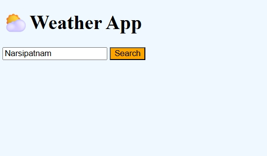
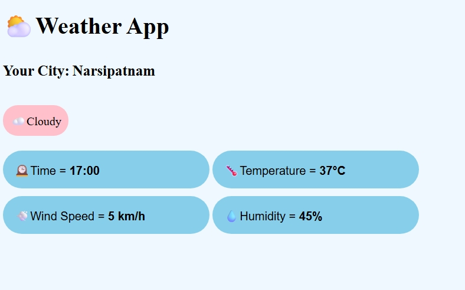

# Weather App

A weather application built using HTML, CSS, JavaScript, and Open-Meteo API.

## Features
- Search weather by city
- Temperature
- Humidity
- Wind speed
- Weather conditions
- Dynamic weather icons

## Technologies
- HTML
- CSS
- JavaScript
- Open-Meteo API
- ES Modules

## Live Demo
https://rbharathi7995.github.io/Weather-app/

## Screenshots

### Home Page

### Weather Result
